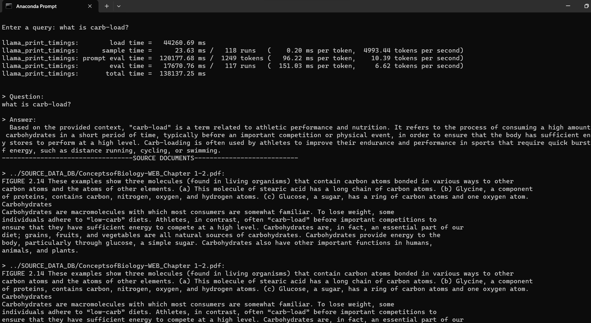
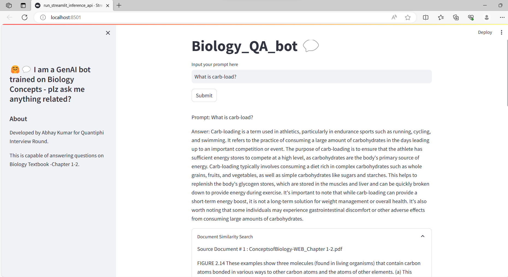

# quantiphi_QA_pdf
This is for Quantiphi Case Study round. 
A RAG based QA app has been developed with source doc as First 2 chapters of ebook - 'Concepts of Biology'

# repo structure:
1. 'src' directory has all the executable codes - pdf_ingest.py, run_inference.py, run_streamlit_inference_api.py. 'constants.py' has the llm, embeddings models mentioned along with configs like chunk_size, overlap.
2. source_db directory has the source pdf file
3. Upon first run of pdf_ingest.py, vector_dbs directory will be populated with persisted vector stores.
4. 'models' directory will have downloaded text generation llama models
5. 'notebooks' directory has all notebook *.ipynb workings
6. local_chat_history directory has all the saved prompt-answers logs
7. repo also has dockerfile and requirements.txt files

## Highlights of this solution:
1. Successful in getting high accuracy answers
2. Uses open source hugging face models for embeddings and text-generations
3. Vector Databases are persisted
4. The QA application is memory enabled to retain and preserve the long conversation context
5. The logs of each prompt-answers are being saved for further analyses like Human Feedback, efficient retrievers
6. The code is flexible in allowing - 
        device type: cpu/gpu; 
        use_history: True/False; 
        show retrieved document sources: True/False; 
        save QA results: True/False
7. The code also gives flexibility in chosing embeddings model and offers choice to use Quantized versions of Text generation models as well.

## Sample Answers to Questions asked:
the complete log of tried question prompts are in 'local_chat_history' directory.
A snapshot to terminal run of inference - 
A snapshot to ui version of inference - 

## Steps to run this repo:
1. Git clone this repo. Navigate 'cd' to the repo directory.

2. Build the Docker image
   docker build -t your_image_name .

3. Run the Docker container
   docker run -it  your_image_name

4. Run the pdf_ingest module to persist the vector store, run command:
      docker run -it your_image_name python src/pdf_ingest.py
5. To test the QA bot in command prompt mode, run command (-- enter the ques prompt in Query prompt in terminal):
      docker run -it your_image_name python src/run_inference.py

6. To test the QA bot in streamlit UI mode:
      docker run -it your_image_name streamlit run src/run_streamlit_inference_api.py

## Evaluation Design:
1. Each prompt and its corresponding answer are saved as csv logs.
2. This needs to be ranked by Business/Client in a scale of 1-3, i.e 3 indicating the most accurate output in terms of ground truth
3. Based on the ranking received, I would then start analysing their corresponding source documents and if need be, would further make my retrieval mechanism more efficient.
4. Assuming we have ground truths for sample prompts, evaluation metrics like (faithfulness, answer_relevancy, context_relevancy context_recall) from ragas library could be used.
5. We can also leverage Langsmith tool to evaluate our responses. 
 

## Further Opportunities of Improvement:
1. For more volumes of PDFs - efficient vector DBs and robust retriever like ParentDocument retriever to be used
2. Speed of Text Generation LLM can be further improved by use of Quantized Lllama models
3. For Images and Tables - we can use ocr modules of python
